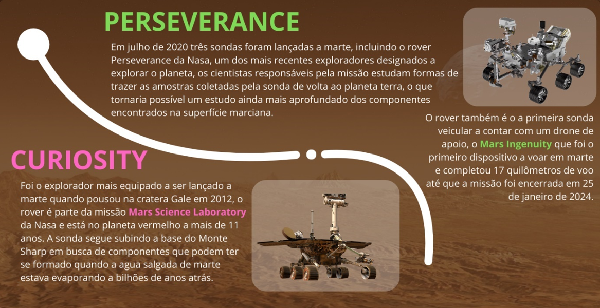

# 🤖 Totem Interativo - Robótica em Marte
<p align="center">
  
  
  
</p>

<div align="center">
  
</div>

## 📋 Sobre o Projeto
O **Totem Interativo - Robótica em Marte** é um sistema digital desenvolvido em **Java** com interface gráfica **Swing**, projetado para coletar **pesquisas de satisfação** de visitantes em exposições sobre **exploração robótica no planeta Marte**. A aplicação visa transformar feedbacks em **dados estatísticos úteis**, auxiliando curadores e organizadores a melhorar a experiência dos visitantes.

## 🛠️ Tecnologias Utilizadas
* [Java](https://www.oracle.com/br/java/) – Lógica de negócio e controle da aplicação
* [Java Swing](https://docs.oracle.com/javase/tutorial/uiswing/) – Desenvolvimento da interface gráfica
* [NetBeans](https://netbeans.apache.org/) – Ambiente de desenvolvimento integrado (IDE)

## 🌟 Funcionalidades em Destaque
| Funcionalidade           | Descrição                                                                 |
| ------------------------ | ------------------------------------------------------------------------- |
| 🎛️ Interface Intuitiva  | Navegação sequencial, simples e acessível para qualquer perfil de usuário |
| 📊 Geração de Métricas   | Cálculo automático de estatísticas com base nas respostas                 |
| 🧠 Validação Inteligente | Controle de entrada para garantir dados consistentes                      |
| 🧱 Arquitetura Modular   | Separação em pacotes lógicos: `modelo`, `apresentacao`, `aps`             |

## 🚀 Como Executar o Projeto
1. Certifique-se de ter o [Java JDK](https://www.oracle.com/java/technologies/javase-downloads.html) instalado
2. Clone este repositório:

   ```bash
   git clone https://github.com/devAndreotti/APS-03.git
   ```
3. Abra o projeto no **NetBeans**
4. Compile e execute a classe `Aps.java`
   *ou* execute o `.jar` localizado em `dist/`

## 📂 Estrutura de Pastas
```bash
totem-robotica-marte/
├── dist/                 → Aplicativo compilado (APS.jar)
├── nbproject/            → Arquivos de configuração do NetBeans
├── src/
│   ├── aps/              → Classe principal (aps.java)
│   ├── apresentacao/     → Interfaces gráficas (Swing)
│   ├── modelo/           → Lógica da aplicação e validações
│   └── img/              → Imagens utilizadas na UI
└── README.md
```

## 💪 Como Contribuir
Contribuições são sempre bem-vindas! Você pode colaborar sugerindo melhorias, relatando problemas ou enviando funcionalidades:
1. Faça um **fork** do repositório
2. Crie uma nova branch: `git checkout -b feature/minha-feature`
3. Realize os commits: `git commit -m "feat: adiciona nova funcionalidade"`
4. Faça o push: `git push origin feature/minha-feature`
5. Abra um Pull Request 🚀

<br>

---

<p align="center">
  Desenvolvido por <a href="https://github.com/devAndreotti" target="_blank"><strong>Ricardo Andreotti Gonçalves</strong></a> 🧑‍💻
</p>

---
